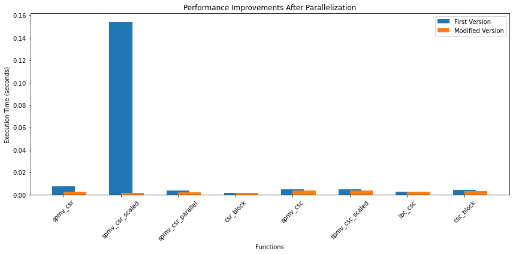
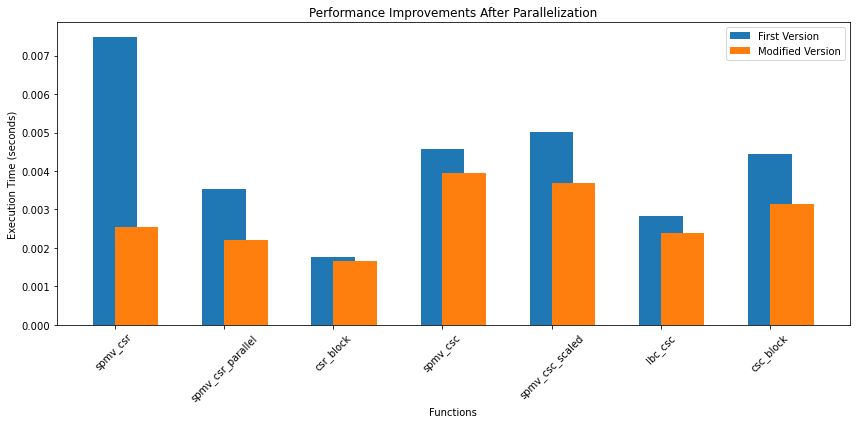

# SPMV Repository

This repository contains various implementations of Sparse Matrix-Vector Multiplication (SPMV) functions. The repository includes different versions of these functions, both before and after optimization through parallelization using OpenMP.

## Functions

### spmv_csr
- **First Version**: The initial implementation of SPMV using Compressed Sparse Row (CSR) format.
- **Modified Version**: Optimized with parallelization to reduce execution time.

### spmv_csr_scaled
- **First Version**: SPMV with CSR format, including scaling operations.
- **Modified Version**: Optimized with parallelization to reduce execution time.

### spmv_csr_parallel
- **First Version**: An initial attempt to parallelize the CSR format SPMV.
- **Modified Version**: Optimized with parallelization to reduce execution time.

### csr_block
- **First Version**: CSR format SPMV with block processing.
- **Modified Version**: Minor optimizations to improve efficiency.

### spmv_csc
- **First Version**: SPMV using Compressed Sparse Column (CSC) format.
- **Modified Version**: Optimized with parallelization to reduce execution time.

### spmv_csc_scaled
- **First Version**: CSC format SPMV with scaling operations.
- **Modified Version**: Optimized with parallelization to reduce execution time.

### lbc_csc
- **First Version**: Load-balanced chunk CSC format SPMV.
- **Modified Version**: Optimized with parallelization to reduce execution time.

### csc_block
- **First Version**: CSC format SPMV with block processing.
- **Modified Version**: Optimized with parallelization to reduce execution time.

## How to Run

To compile and run the files, use the following commands:

```sh
clang++ -fopenmp -std=c++11 -Iinclude main.cpp MV.cpp readmatrixcsc.cpp readmtx.cpp -o spmv
./spmv
```


## Performance Improvements
The table below illustrates the performance improvements observed after parallelizing the various SPMV functions.

| Function           | First Version (seconds) | Modified Version (seconds) |
|--------------------|--------------------------|-----------------------------|
| spmv_csr           | 0.00748587               | 0.0025351                   |
| spmv_csr_scaled    | 0.153944                 | 0.00175905                  |
| spmv_csr_parallel  | 0.0035405                | 0.002196                    |
| csr_block          | 0.0017719                | 0.0016719                   |
| spmv_csc           | 0.0045669                | 0.003937                    |
| spmv_csc_scaled    | 0.00500393               | 0.0036962                   |
| lbc_csc            | 0.00282079               | 0.0024000                   |
| csc_block          | 0.00444007               | 0.00313282                  |


## Visual Results

The following images illustrate the performance improvements of the SPMV functions after parallelization.

### Performance Plot



### Another Visualization without spmv_csr_scaled



